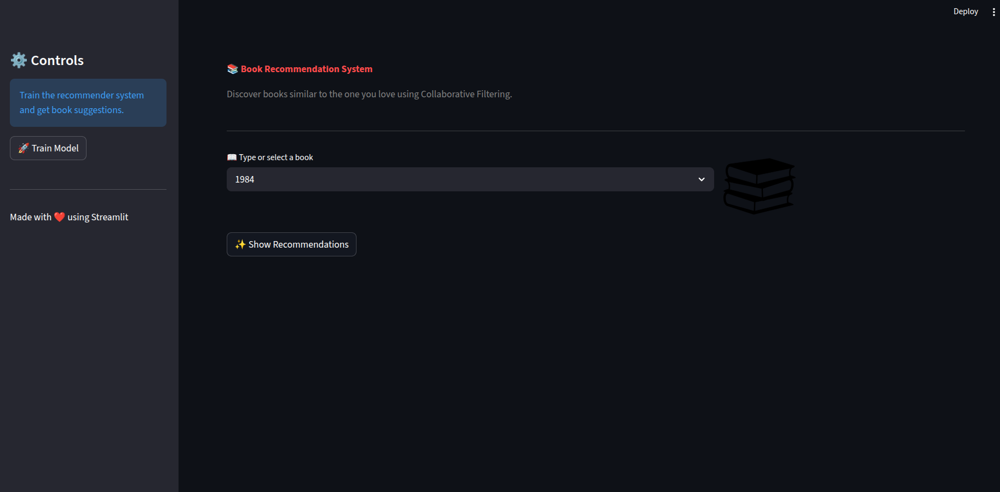
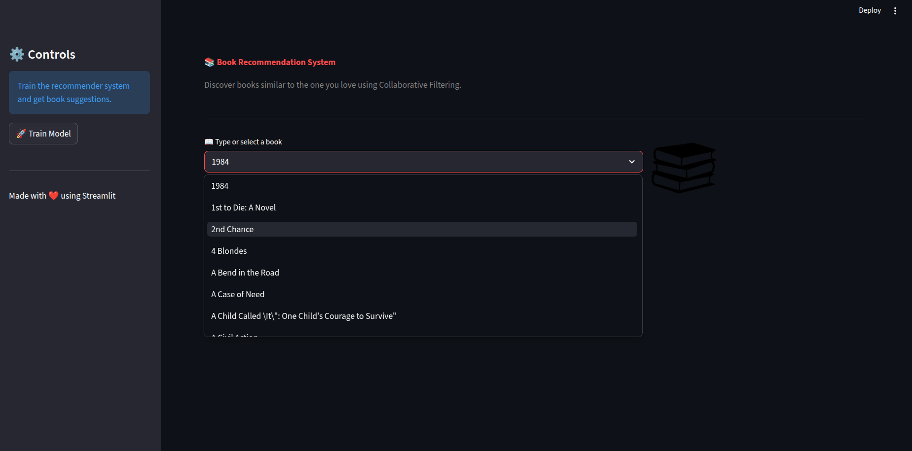
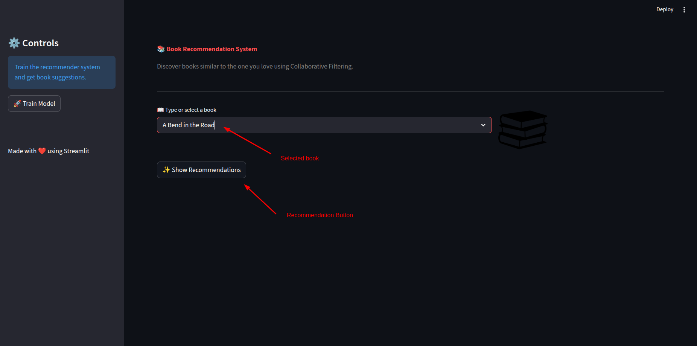
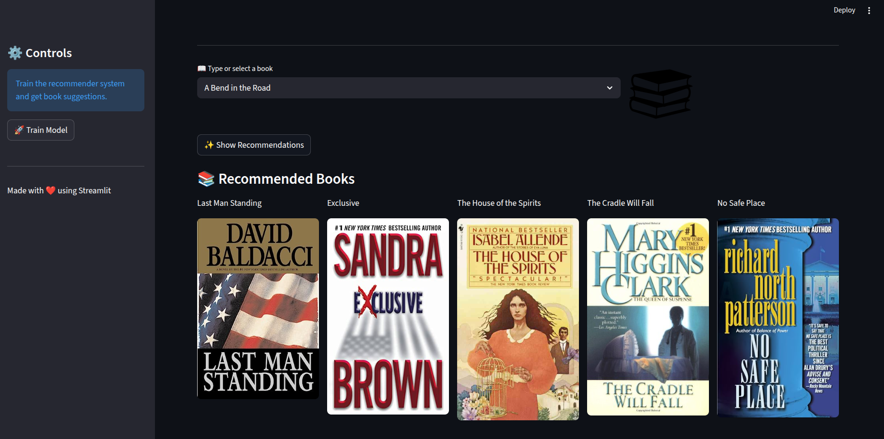
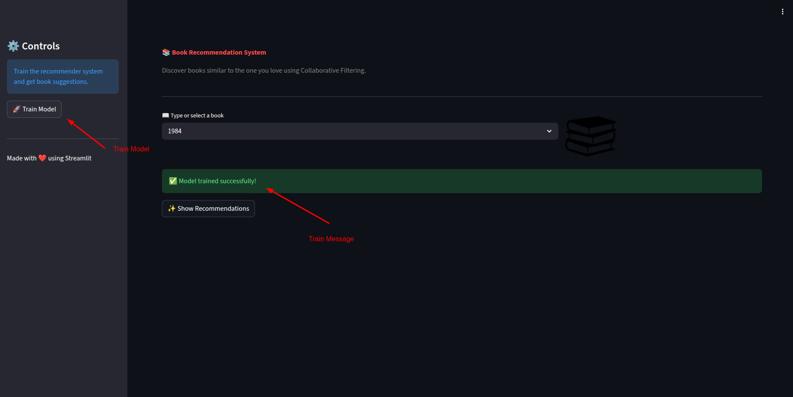

# Book Recommendation System 

## Project Overview

- This project is a Book Recommendation System that suggests similar books using Collaborative Filtering based on user rating patterns. It analyzes user–book interaction data to identify relationships between books and recommend titles that readers with similar interests have enjoyed.

- The recommendation engine is built using Python and machine learning techniques, and the application interface is developed with Streamlit for interactive user experience. 

## Objective

- The main goal of this project is to build a machine learning solution that can:

    - Analyze user–book rating data to identify relationships between books.
    - Recommend books that have similar reading patterns and user preferences.
    - Provide an interactive interface using Streamlit for users to explore recommendations easily.

## Key Features

- Recommends books by analyzing user–book rating patterns and similarity between books.
- Simple and user-friendly UI where users can select a book and receive recommendations instantly.
- Applies machine learning techniques to compute similarity between books.
- Uses pandas, NumPy, and sparse matrices for efficient handling of large user–item matrices.
- Docker Support
    - Run the full app directly using a Docker image.
    - No need to install dependencies manually

## Why This Project is Useful

- Helps Users Discover New Books
- Improves User Experience
- Demonstrates Real-World Recommendation Systems
- Handles Large Amounts of Data Efficiently
- Practical Machine Learning Application

-----

## How to run this project

- Create the virtual environment

```bash
conda create -n book_recommendation python=3.11 -y
```

- Activate the virtual environment

```bash
conda activate book_recommendation
```

- Install all the requirements in virtual environment

```bash
pip install -r requirements.txt
```

- Start the app to provide the recommendations

```bash
streamlit run app.py
```

-----


## Run the App Using Docker Image (No Setup Required)

- If you don’t want to install dependencies locally, you can run the complete Book Recommendation System app directly using Docker.

- [DockerHub Image](https://hub.docker.com/r/jatintomer/book_recommendation_system)

-----

## Snapshots of the Book Recommendation System User Interface

### Home Page



### Book Selection



### Book Prediction



### Prediction 



### Model Training


